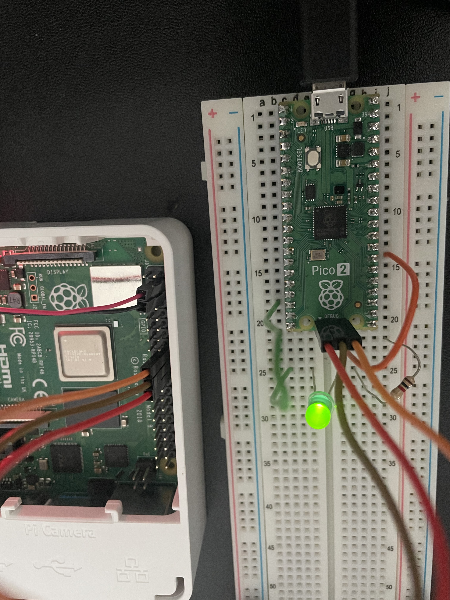

# OpenOCD Debugging on Pico2

A simple blink program to detail the steps to enable debugging on the Pico2 (target), from a Raspberry Pi 4 (host), connected via the GPIO pins using OpenOCD.

Check out the References link to see where I pulled all my information from.

## Table of Contents

[Objective](#objective)<br>
[Assumptions](#assumptions)<br>
[Setup](#setup)<br>
[Install](#install)<br>
[Execute](#execute)<br>
[References](#references)<br>

## Objective
- Debug a simple blink program via OpenOCD

## Assumptions
- Assuming you've already installed & setup all packages & libraries for the pico-sdk, if not then check the other directories for the steps.

## Setup
```
Host System:
Raspberry Pi 4 Model B

Target System:
Raspberry Pi Pico 2 (RP2350)

Current Linux Kernel:
Linux <hostname> 5.15.0-1076-raspi #79-Ubuntu SMP PREEMPT Wed Mar 26 06:11:54 UTC 2025 aarch64 aarch64 aarch64 GNU/Linux
```

RPi4 to RP2350 GPIO Connections
|      RPi4       |      RP2350     |
|-----------------|-----------------|
| GPIO 24         | SWDIO           |
| GPIO 25         | SWCLK           |
| GND             | SWD GND         |


RP2350 to Components
|     RP2350      |   Components    |
|-----------------|-----------------|
| GP21 (pin27)    | 1kOhm -> LED    |
| GND  (pin18)    | LED (Cathode)   |


Picture of connections:


## Install
Prior to Building OpenOCD, ensure these packages are installed: linuxgpiod, gpiod, libgpiod-dev, libtool<br>

```
$ sudo apt update
$ sudo apt install <package_name>
```

- Build & Install OpenOCD<br>
```
$ git clone https://github.com/raspberrypi/openocd.git
```

- Execute Build Scripts
```
$ ./bootstrap
$ ./configure --enable-linuxgpiod -enable-bcm2835gpio #configure build for the --enabled-<packages>
```

- Build & Install
```
$ make
$ sudo make install #install in /usr/local/share/openocd/
```

## Execute
[] Prior Executing OpenOCD:<br>

    [] export OPENOCD_SCRIPTS environment variable<br>
```
$ export OPENOCD_SCRIPTS=/usr/local/share/openocd/scripts/
```

    [] Install raspberrypi-swd.cfg file into <openocd_installation_dir>/scripts/interface/<br>
    -- copy from my current github location:<br>
```
$ cp ./raspberrypi-swd.cfg <openocd_installation_dir>/scripts/interface/
```

    -- OR copy from the pico-vscode/scripts/raspberrypi-swd.cfg [link](https://github.com/raspberrypi/pico-vscode/blob/main/scripts/raspberrypi-swd.cfg)<br>

[] Execute OpenOCD:<br>

    [] Startup OpenOCD Server at localhost:3333<br>
    # this is the default for OpenOCD, I believe you can modify the port it lives at
```
sudo openocd -d -f interface/raspberrypi-swd.cfg -f target/rp2350.cfg
```

[] Connecting to OpenOCD Server via GDB

    [] Build your target .elf file with debug options enabled
```
$ mkdir debug
$ cd debug && cmake -DCMAKE_BUILD_TYPE=Debug ..
$ make
```

    [] Start GDB and connect
```
$ gdb <target>.elf
$ (gdb) target remote localhost:3333
# At this point, you should be connected to the OpenOCD Server
# Start setting breakpoints and stepping through program execution
```

## References
[OpenOCD's webpage](https://openocd.org/)<br>
[OpenOCD's documentation](https://openocd.org/doc/html/index.html#toc-Running-1)<br>
[Electronics Hub](https://www.electronicshub.org/programming-raspberry-pi-pico-with-swd/)<br>
