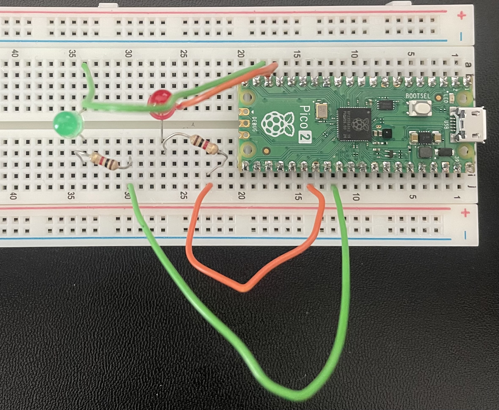

# USB Serial Input Program

## Table of Content
[Overview](#overview)<br>
[Objective](#objective)<br>
[Setup](#setup)<br>
[Building](#building)<br>
[Executing](#executing)<br>
[Learnings](#learnings)<br>
[Useful](#useful)<br>
[Resources](#resources)<br>

## Overview

An introductory project to get familiar with the basics of:
- Interacting with the pico2 via user inputs through serial

2 Source Files:
usb_input.c -> basic source file that is controlling 1 LED
usb_input_lvl2.c -> source file controlling 2 LEDs

## Objective

[] Control the state of LEDs connected to the pico2 

## Setup

Here's how I setup the GPIO Ports on the Pico2

Pico2 Connection:
LED1 -> GP22(pin29)<br>
LED2 -> GP21(pin37)<br>

Picture:


## Building 
1. Setup & call cmake
    ```
    $ mkdir build
    $ cd build
    $ cmake ..
    ```

    - PICO_PLATFORM moved to CMakeLists.txt, otherwise call cmake -DPICO_PLATFORM=rp2350-arm-s ..

2. Call make to create the target
    ```
    $ make
    ```

3. Move <project_name>.uf2 onto the pico board connected via USB
   - Drag and drop the uf2 file OR

    ```
    $ cp ./build/<project_name>.uf2 /media/<user>/RP2350
    ```
## Learnings

1. Reading from Serial
- Depending if you're reading a char or string from the input, you would either use getchar() or fgets() respectively.

## Useful

- View logs from the kernel to see USB connections
    ```
    $ watch -n 1 "sudo dmesg | tail -n 20"
    ```

## Resources

